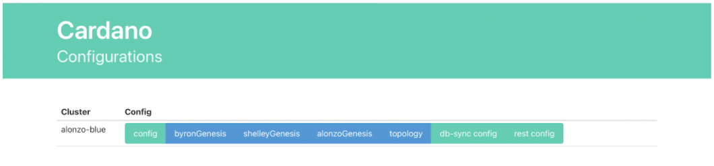

# Getting started

## Welcome to the Alonzo Blue Testnet!  

We are excited to have you join us on the journey to delivering Plutus scripts for Cardano.  We will be running through a series of structured tests on the brand-new Alonzo-era Cardano node so that we can improve the experience for other Plutus users.  At this stage, the software and documentation are both very new, so there will certainly be improvements that can be made.  You will also be using the Cardano node directly rather than the Plutus Application Backend (PAB) that we are developing to simplify the process of submitting and executing Plutus scripts. Your role in helping us identify and make these improvements is very important.  Your feedback is essential and will be listened to!

## Prerequisites

- Attend the Alonzo Testnet Briefing Meeting or Read the Testnet Briefing Notes.
- Read the Alonzo Testnet Code of Conduct.  This governs your behaviour and responsibilities on the Alonzo Testnets.
- Register yourself on Discord and join the designated channel.
- Make sure you can access:

	1. The IOHK Tutorial Documentation at: https://docs.cardano.org/introduction
	2. The Alonzo Blue Testnet configuration information at: [https://hydra.iohk.io/build/6510764/download/1/index.html](https://hydra.iohk.io/build/6510764/download/1/index.html)
	3. Either, the Linux Build at: [https://hydra.iohk.io/build/6538899/download/1/cardano-node-1.27.0-linux.tar.gz
](https://hydra.iohk.io/build/6538899/download/1/cardano-node-1.27.0-linux.tar.gz)
	4. or the Docker Image at: [https://hydra.iohk.io/build/6538875
](https://hydra.iohk.io/build/6538875)

	**Note that these are the correctly tagged versions for alonzo-blue1.0 – please check the Discord channel for any updates to these tags.**

- You should be comfortable with using Shell commands and have a basic understanding of the Cardano ecosystem.

- Set up your platform.  Unless you are experienced with building the node from source, you should use the pre-built Node and CLI binaries that are supplied by IOG.

- You will need a Physical Host Machine, Virtual Machine or AWS instance with **at least 2 cores, 8GB of RAM, and at least 10GB of free storage.**
- If you are using Docker.
Download and install the latest Docker for your system.  If you are using Docker Desktop, ensure that you allow **at least 6GB of memory.**
- If you are using the binary files.
Make sure you are running a recent stable version of Linux (eg Ubuntu 20.04 or 18.04, Windows 10, or MacOS 10.14 or later).  

	**Note that there is no support for Windows or MacOS at this stage.**

- You should need only a bare version of the system (no additional installation).

- Make sure you are on a network that is not firewalled. In particular, we will be using TCP/IP port 3001 by default to establish connections with other nodes, so this will need to be open to the world.

**This should be everything that you need to get you up and running.**

## Objectives

In the first set of exercises, we will make sure that you can:

1. Set up and run an Alonzo-capable node;
2. Connect your node to the Alonzo Blue testnet blockchain;
3. Obtain some test ada to use in the testnet.

## Exercise 1

Download and install the correct version of the Cardano node and CLI software.  

Note that we will be updating the software regularly to add features, fix bugs, improve performance, so you will need to use the correctly tagged version of the node at each stage.  

Unless you are already an expert, we do not recommend that you build binaries from source — we will not be able to help you if you encounter problems with the build. Make sure that your search path includes the location for all the binaries that you have downloaded.

1. Verify your versions of cardano node and cardano cli:

		cardano-node –-version

		cardano-cli –-version

	or

		docker run cardano-node run --version

2. Create a working directory for your node instance.  Download the genesis files, topology file, and config file for the Alonzo Blue testnet and store them in your working directory.  

3. Start the node using the configuration information that you have downloaded:

		cardano-node run \
		--topology path/to/alonzo-blue-topology.json \
		--database-path /db \
		--socket-path path/to/node.socket \
		--host-addr 0.0.0.0 \
		--port 3001 \
		--config path/to/alonzo-blue-config.json

**You are running a so-called “passive” node.  Your node will not participate in block production or verification, and it will connect to the dedicated IOG Testnet relay nodes to obtain information from the network.**

Make sure that you set the CARDANO_NODE_SOCKET_PATH environment variable correctly.  You may want to update your .bashrc or other configuration so this is done automatically in future.

Check that your instance of the node is properly connected to the Alonzo Blue Testnet and is fully synchronised.  You may need to wait a few minutes.  Use the relevant **cardano-cli commands** to query the tip of the blockchain.

Congratulations!  You have a working node connected to the first-ever public Alonzo Cardano network!

4. Use cardano-cli to generate payment keys and address
5. Request a “goody bag” containing a parcel of **test ada** for use on the Testnet.
6. Log on to the dedicated Discord channel and introduce yourself.  In addition to your peers, you will meet IOG staff who are responsible for running the testnet, stake pool operators who are responsible for producing blocks and ensuring that the Alonzo system works, community advisors and others. Please follow the rules on good conduct!

The next full exercise (Exercise 3) will involve building, signing and submitting simple Plutus transactions using your own node.  

Before then, you might want to participate in the Hard Fork Event using the optional Exercise 2.

**Please let us know of any problems that you have encountered**

Via the Discord channel for general questions.
Via the issue tracker at [https://github.com/input-output-hk/cardano-node/issues](https://github.com/input-output-hk/cardano-node/issues) for any bugs.

KH @ 3/6/21
