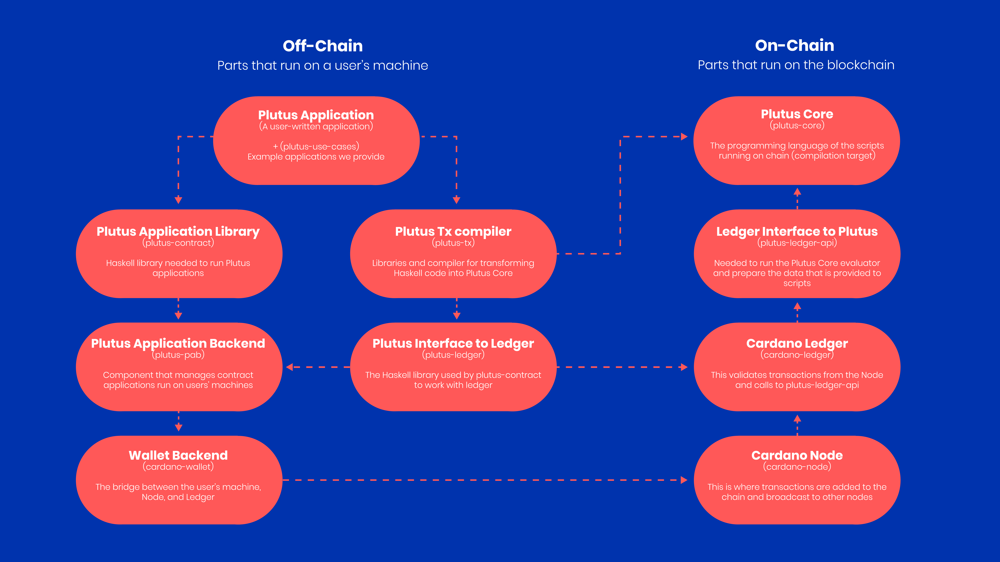

# What is Plutus?

Plutus is the native smart contract language for Cardano. It is a Turing-complete language written in Haskell, and Plutus smart contracts are effectively Haskell programs. [Alonzo](https://iohk.io/en/blog/posts/2021/04/08/smart-contracts-%E2%80%93-here-we-come/) is the name of the protocol upgrade that will introduce the support for Plutus smart contracts on Cardano. By using Plutus, you can be confident in the correct execution of your smart contracts. It draws from modern language research to provide a safe, full-stack programming environment based on Haskell, the leading purely-functional programming language.

### Plutus smart contracts
Plutus smart contracts consist of parts that run on the blockchain (on-chain code) and parts that run on a user’s machine (off-chain or client code). Off-chain code can be written using the Plutus Application Framework (PAF), and this code is then compiled by the GHC (Glasgow Haskell Compiler), whereas on-chain code is compiled by the Plutus compiler into Plutus Core. 

### Accounting model used by Plutus
Cardano uses the extended UTXO accounting model (EUTXO) which extends the unspent (U) transaction (TX) output (O) accounting model (UTXO) model (used by Bitcoin). In the UTXO model, a *transaction* has *inputs* and *outputs*, where the **inputs** are unspent outputs from previous transactions. As soon as an output is used as input in a transaction, it becomes spent and can never be used again. The **output** is specified by an *address* (a public key or public key hash) and a *value* (consisting of an ada amount and optional, additional native token amounts).

EUTXO extends the UTXO model by allowing output addresses to contain complex logic to decide which transactions can unlock them, and by adding *custom data* to *all* outputs. This model offers unique advantages over other accounting models. The success or failure of transaction validation depends only on the transaction itself and its inputs and *not* on anything else on the blockchain. Consequently, the validity of a transaction can be checked *off-chain* before the transaction is sent to the blockchain. A transaction can still fail if some other transaction concurrently consumes an input that the transaction is expecting. However, if all inputs are still present, the transaction is *guaranteed* to succeed.

### Plutus Core
Plutus Core is the scripting language used by Cardano to implement the EUTXO model. It is a simple, functional language similar to Haskell, and a large subset of Haskell can be used to write Plutus Core scripts. As a smart contract author, you don’t write any Plutus Core; rather, all Plutus Core scripts are generated by a Haskell compiler plugin.

These scripts will be executed by nodes during transaction validation ‘live’ on the chain. They will either lock EUTXOs in the form of validator scripts or as minting policies, which control the minting and burning of native tokens.
 
In practice, when developing smart contracts, you will write validator scripts in Haskell, which will then be automatically compiled into Plutus Core using a GHC plug-in called  Plutus Tx.

### Plutus Application Framework (PAF)
The PAF provides easy access to services that are commonly used by Plutus applications. Applications deployed using the framework’s libraries can be run on the Plutus application backend, which provides runtime support for access to the blockchain and other concerns such as persistence, logging, and monitoring. Applications written on top of the PAF automatically provide an HTTP and WebSocket interface that can interact with the application from the web browser. 

The on-chain state of validator scripts can only be modified by transactions that spend and produce script output. When writing a Plutus application, we need to consider not only the on-chain part of the application (the Plutus Core scripts) but also the off-chain part that builds and submits transactions. 

The off-chain code is written in Haskell, just like the on-chain code, unlike Ethereum where the on-chain code is written in Solidity, but the off-chain code is written in JavaScript. That way, the business logic only needs to be written once. This logic can then be used in the validator script and in the code that builds the transactions that run the validator script. 

### Plutus Application Backend (PAB)
The PAB is currently being developed and will execute the off-chain component of Plutus applications. It will manage application requests to the wallet backend and node, store the application state, and offer an HTTP API for managing application instances.

### Plutus and native tokens
Each native token comes with its own [minting policy](https://github.com/input-output-hk/cardano-documentation/blob/staging/content/07-native-tokens/01-learn.mdx#minting-policy), which determines the conditions under which tokens can be minted and burnt. With the deployment of Plutus, users will be able to write minting policies in Haskell and compile them to Plutus Core. During the minting or burning process, the Plutus Core policy script will be executed in the context of the minting or burning transaction, and the script will have to approve or forbid the action. This feature will further accelerate the growth of Non Fungible Tokens (NFTs) on Cardano by enabling the creation of much more complex minting policies and allowing the creation of NFTs in a trustless manner.

### Advantages of Plutus
Plutus provides considerable security advantages. It delivers an easier, more robust way to show that your smart contracts are correct and will not encounter the problems found in previous smart contract language design. Plutus enables a novel integrated approach to smart contract and distributed application development that is more convenient and safer than previous alternatives. Both the on-chain and off-chain code are based on the same language. You use a uniform code base, which the Plutus toolchain then automatically separates into on-chain and off-chain code and packages for deployment. ‌ Additionally, in contrast to Ethereum, Plutus supports user-defined tokens (both fungible and non-fungible natively which requires much less code. 
